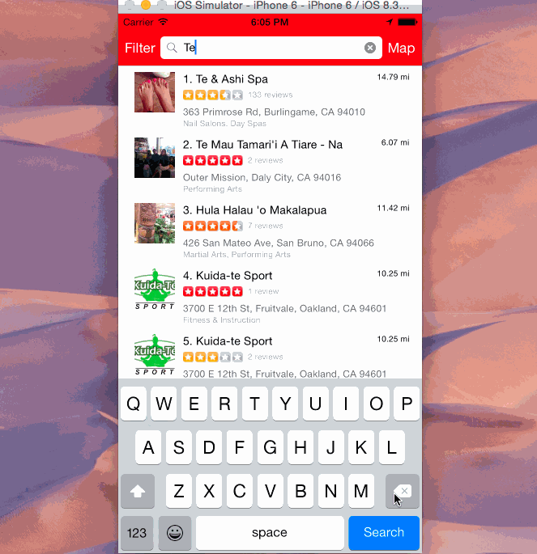

## Yelp Light

This is a light app for finding and detailing location information. [Yelp API](http://www.yelp.com/developers).

Time spent: 18 hrs

### Features

#### Required

- [X] Search results page
   - [X] Table rows should be dynamic height according to the content height
   - [X] Custom cells should have the proper Auto Layout constraints
   - [X] Search bar should be in the navigation bar (doesn't have to expand to show location like the real Yelp app does).
- [X] Filter page. Unfortunately, not all the filters are supported in the Yelp API.
   - [X] The filters you should actually have are: category, sort (best match, distance, highest rated), distance, deals (on/off).
   - [X] The filters table should be organized into sections as in the mock.
   - [X] You can use the default UISwitch for on/off states. Optional: implement a custom switch
   - [X] Clicking on the "Search" button should dismiss the filters page and trigger the search w/ the new filter settings.
   - [X] Display some of the available Yelp categories (choose any 3-4 that you want).

#### Optional

- [X] Search results page
   - [X] Infinite scroll for restaurant results
   - [X] Implement map view of restaurant results
- [X] Filter page
   - [X] Radius filter should expand as in the real Yelp app
   - [X] Categories should show a subset of the full list with a "See All" row to expand.
- [ ] Implement the restaurant detail page.

#### Extra

- [X] Filter page: rounded corners on grouped sections (so difficult...)

### Walkthrough

#### Main


#### Landscape demo


#### Long name screenshot


### Installation
* Requires Xcode 6.3 beta
* Retrieve the Yelp API tokens from http://developer.yelp.com
* Create a folder called Config in the main folder (the one that contains the Podfile)
* In the config folder, create YelpLightConfig.xcconfig
* Inside MyConfig.xcconfig, add:

````
    YELP_LIGHT_CONSUMER_KEY = your-consumer-token
    YELP_LIGHT_CONSUMER_SECRET = your-consumer-secret
    YELP_LIGHT_ACCESS_TOKEN = your-token
    YELP_LIGHT_ACCESS_SECRET = your-secret
````

* Open the Rotten.xcworkspace file, and build!


Credits
---------
* [Yelp API](http://www.yelp.com/developers)
* [AFNetworking](https://github.com/AFNetworking/AFNetworking)
* [BDBOAuth1Manager](https://github.com/bdbergeron/BDBOAuth1Manager)
* YelpClient oauth implementation:
   * [RecommendIt](https://github.com/derrickshowers/RecommendIt)
   * [iOSTwitterSwift](https://github.com/alexnj/iOSTwitterSwift)